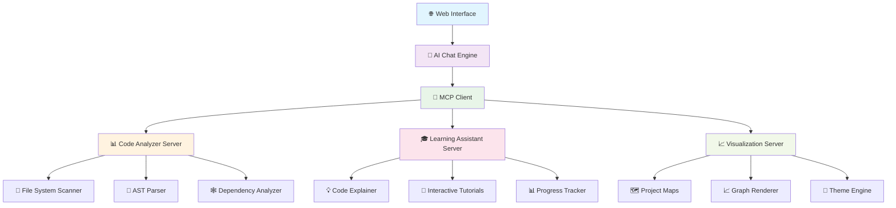

# 🚀 MCP Code Analyzer

<div align="center">

<!-- Language Navigation -->
<p align="center">
  <a href="README.md">
    
  </a>
  <a href="README.ru.md">
    
  </a>
</p>


[](https://github.com)
[](https://modelcontextprotocol.io)
[](https://www.typescriptlang.org/)
[](https://nextjs.org/)
[](https://openai.com/)


*Intelligent code analysis and visualization powered by Model Context Protocol*

[🎯 Features](#-features) • [🏗️ Architecture](#️-architecture) • [🚀 Quick Start](#-quick-start) • [📖 Documentation](#-documentation) • [🤝 Contributing](#-contributing)

</div>

---
## ❓ Why MCP Code Analyzer?

> Traditional static code analyzers are passive.  
> MCP Code Analyzer is active, adaptive, and conversational.  
> It doesn’t just tell you *what* — it shows you *why*.

With the power of Model Context Protocol and AI integration:
- Developers receive context-aware feedback in real-time.
- Complex projects are broken down visually.
- Learning is personalized and gamified.

## 🧪 **Experimental Project Notice**

> ⚠️ **This is an experimental project!** 
> 
> We're exploring the cutting-edge intersection of AI-powered code analysis and interactive visualization using the Model Context Protocol (MCP). This project serves as a research playground for developing next-generation developer tools.

---

## 📋 **Project Overview**

MCP Code Analyzer is an innovative developer assistant that transforms static code into interactive, visual experiences. Built on the Model Context Protocol, it provides intelligent code analysis, real-time visualization, and personalized learning modules to help developers understand, navigate, and improve their codebases.
[](https://github.com/ivan-meer/mcp-code-analyzer/projects)

### 🎯 **Core Vision**
Transform the way developers interact with code by providing:
- 🔍 **Intelligent Analysis** - Deep understanding of code structure and patterns
- 📊 **Interactive Visualization** - Beautiful, clickable code maps and dependency graphs
- 🎓 **Adaptive Learning** - Personalized explanations and tutorials
- 🔗 **Seamless Integration** - Native MCP protocol support for extensibility

---

## ✨ **Features**

<table>
<tr>
<td width="50%">

### 🔍 **Code Analysis Engine**
- 📁 **Project Structure Mapping**
- 🕸️ **Dependency Graph Generation**
- 🏗️ **Architecture Pattern Detection**
- 📈 **Code Quality Assessment**
- 🔍 **Semantic Code Search**

</td>
<td width="50%">

### 📊 **Interactive Visualization**
- 🗺️ **3D Project Maps**
- 📈 **Real-time Dependency Graphs**
- 🎨 **Syntax-aware Code Highlighting**
- 📱 **Responsive Visual Interface**
- 🎭 **Customizable Themes**

</td>
</tr>
<tr>
<td width="50%">

### 🎓 **Learning Assistant**
- 💡 **Interactive Code Explanations**
- 🧩 **Pattern Recognition Training**
- 📚 **Contextual Documentation**
- 🎯 **Skill-based Recommendations**
- 🏆 **Progress Tracking**

</td>
<td width="50%">

### 🔧 **Developer Experience**
- ⚡ **Real-time Analysis**
- 🔌 **MCP Protocol Integration**
- 🌐 **Multi-language Support**
- 📦 **Plugin Architecture**
- 🔄 **Hot Reload Capabilities**

</td>
</tr>
</table>

---

## 🏗️ **Architecture**

<div align="center">



</div>

### 🏛️ **Core Components**

| Component | Description | Technology |
|-----------|-------------|------------|
| 🌐 **Web Interface** | Modern, responsive UI | Next.js 15, React 19, Tailwind CSS |
| 🧠 **AI Engine** | Intelligent code understanding | Anthropic Claude, OpenAI GPT |
| 🔧 **MCP Integration** | Protocol-based tool communication | Model Context Protocol |
| 📊 **Analysis Engine** | Code parsing and analysis | AST parsers, static analysis |
| 🎨 **Visualization** | Interactive graphics and charts | D3.js, Three.js, Canvas API |
| 💾 **Data Layer** | Persistent storage | PostgreSQL, Drizzle ORM |

---

## 🛠️ **Technology Stack**

<div align="center">

### **Frontend**
[](https://nextjs.org/)
[](https://reactjs.org/)
[](https://www.typescriptlang.org/)
[](https://tailwindcss.com/)

### **Backend & AI**
[](https://nodejs.org/)
[](https://www.anthropic.com/)
[](https://openai.com/)
[](https://modelcontextprotocol.io/)

### **Data & Storage**
[](https://www.postgresql.org/)
[](https://orm.drizzle.team/)

### **Development Tools**
[](https://eslint.org/)
[](https://prettier.io/)
[](https://typicode.github.io/husky/)

</div>

---

## 🚀 **Quick Start**

### 📋 **Prerequisites**

```bash
# Required versions
Node.js >= 18.0.0
npm >= 9.0.0
PostgreSQL >= 14.0
```

### ⚡ **Installation**

```bash
# Clone the repository
git clone https://github.com/your-username/mcp-code-analyzer.git
cd mcp-code-analyzer

# Install dependencies
npm install

# Set up environment variables
cp .env.example .env.local
# Edit .env.local with your API keys

# Initialize database
npm run db:migrate
npm run db:seed

# Start development server
npm run dev
```

### 🌐 **Access the Application**

```
🌍 Web Interface: http://localhost:3000
📊 Analytics Dashboard: http://localhost:3000/analytics
🔧 MCP Server Status: http://localhost:3000/mcp/status
```

---

## 📁 **Project Structure**

```
mcp-code-analyzer/
├── 📁 app/                     # Next.js app directory
│   ├── 📁 api/                 # API routes
│   ├── 📁 components/          # React components
│   └── 📁 lib/                 # Utilities and configurations
├── 📁 mcp-servers/             # MCP server implementations
│   ├── 📁 code-analyzer/       # Code analysis server
│   ├── 📁 learning-assistant/  # Learning module server
│   └── 📁 visualization/       # Visualization server
├── 📁 docs/                    # Documentation
├── 📁 tests/                   # Test suites
├── 📁 scripts/                 # Build and deployment scripts
└── 📄 README.md               # This file
```

---

## 🎨 **Screenshots & Demos**

<div align="center">

### 🗺️ **Interactive Project Map**


### 📊 **Dependency Visualization**


### 🎓 **Learning Interface**


</div>

---

## 📖 **Documentation**

| 📚 Section | 📄 Description |
|------------|----------------|
| [🏗️ Architecture Guide](docs/architecture.md) | System design and component overview |
| [🔧 MCP Server Development](docs/mcp-servers.md) | Creating custom MCP servers |
| [🎨 UI Component Library](docs/components.md) | Reusable UI components |
| [📊 Visualization API](docs/visualization.md) | Creating interactive visualizations |
| [🔌 Plugin Development](docs/plugins.md) | Extending functionality |
| [🧪 Testing Guide](docs/testing.md) | Testing strategies and tools |

---

## 🗺️ **Roadmap**

<details>
<summary><b>🎯 Phase 1: Foundation (Current)</b></summary>

- [x] Project structure setup
- [x] Basic MCP integration
- [ ] Core analysis engine
- [ ] Basic visualization
- [ ] Web interface

</details>

<details>
<summary><b>🚀 Phase 2: Core Features</b></summary>

- [ ] Advanced code analysis
- [ ] Interactive project maps
- [ ] Learning modules
- [ ] Multi-language support
- [ ] Plugin system

</details>

<details>
<summary><b>🌟 Phase 3: Advanced Features</b></summary>

- [ ] 3D visualizations
- [ ] Real-time collaboration
- [ ] AI-powered insights
- [ ] Performance optimization
- [ ] Cloud deployment

</details>

---

## 🤝 **Contributing**

We welcome contributions! This experimental project thrives on community input and innovative ideas.

### 🎯 **How to Contribute**

1. 🍴 **Fork** the repository
2. 🌿 **Create** a feature branch (`git checkout -b feature/amazing-feature`)
3. 💻 **Commit** your changes (`git commit -m 'Add amazing feature'`)
4. 📤 **Push** to the branch (`git push origin feature/amazing-feature`)
5. 🎉 **Open** a Pull Request

### 📝 **Contribution Guidelines**

- 📋 Follow the [Code of Conduct](CODE_OF_CONDUCT.md)
- 🧪 Include tests for new features
- 📚 Update documentation
- 🎨 Follow the established coding style

---

## 📄 **License**

This project is licensed under the MIT License - see the [LICENSE](LICENSE) file for details.

---

## 🙏 **Acknowledgments**

- 🤖 **Model Context Protocol** team for the innovative protocol
- 🎨 **shadcn/ui** for beautiful UI components
- 🚀 **Vercel** for the AI SDK and hosting platform
- 🧠 **Anthropic** and **OpenAI** for AI capabilities
- 🌟 **Open Source Community** for inspiration and tools

---

<div align="center">

### 🚀 **Ready to explore the future of code analysis?**

[](docs/getting-started.md)
[](docs/)
[](https://discord.gg/mcp-analyzer)

---

**⭐ Star this repository if you find it helpful!**

*Made with ❤️ by the MCP Code Analyzer team*

</div>
